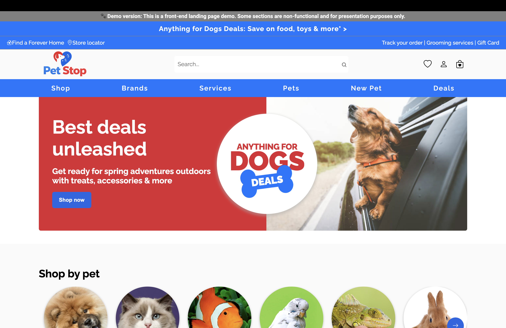

# PetStop — Pet Store UI

A modern, responsive e-commerce landing page for a pet store, built with vanilla HTML, CSS, and JavaScript. Deployed on Vercel.

**[Live Demo →](https://pet-store-ui-iota.vercel.app/)**

---

## Preview

---

## Features

- **Responsive design** — mobile-first layout that adapts across all screen sizes
- **Interactive navigation** — hamburger menu for mobile with smooth open/close transitions
- **Pet category browsing** — visual carousel for Dogs, Cats, Fish, Birds, Reptiles, Small Pets, Farm Pets, and Wild Birds
- **Deals & promotions section** — highlights multi-buy offers and clearance items
- **New pet welcome shop** — dedicated section for puppy and kitten first-time owners
- **Featured brands** — showcases premium brands (Hill's Science Diet, Purina Pro Plan, Royal Canin, Orijen, Ziwi, Advance)
- **Shopping benefits bar** — free shipping, fast delivery, vet-approved products, and easy returns
- **Newsletter signup** — footer subscription form
- **Store locator & service links** — order tracking, grooming services, gift cards

> **Demo note:** This is a front-end only project. Some sections (search, cart, checkout) are non-functional and for presentation purposes only.

---

## Tech Stack

- HTML5
- CSS3
- JavaScript (vanilla)
- Vercel

---
